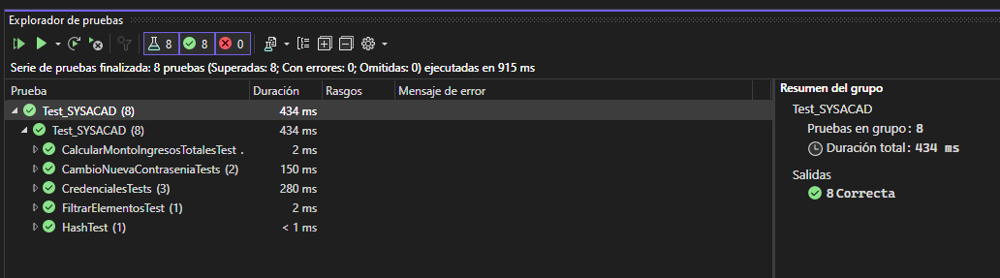
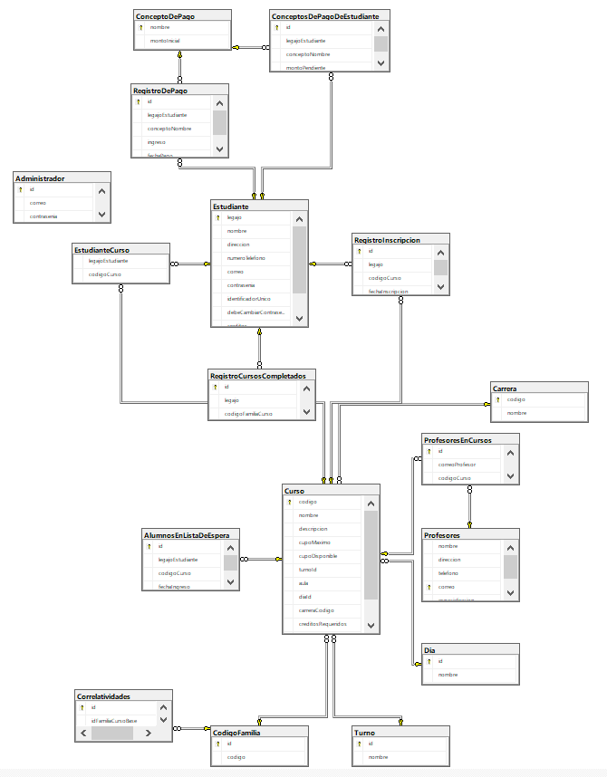

# SYSCAD - Enrollment Management System

SYSCAD is an enrollment management system designed to streamline the student enrollment process in a faculty. This system enables administrators and students to perform various actions related to enrollment, course management, and academic tracking.

## Author:
-Mariano Nicolas Aquino

## Key Features

### 1. Register Student

Allows administrators to efficiently register new students in the system. The system requests essential information such as full name, identification number, address, phone number, email, and provisional password. It verifies the validity and uniqueness of the data, automatically assigns a unique student number, and, if a valid email address is provided, sends a notification with login credentials.

### 2. Manage Courses

Enables administrators to add, edit, or delete courses available for enrollment. Course management is done intuitively, with information validation to ensure uniqueness. Administrators can add new courses, edit existing information, and remove unwanted courses. This ensures that the list of courses available for enrollment is always up-to-date.

### 3. Enroll Student in Course

Empowers students to enroll in specific courses from a list of available courses. The system automatically checks the availability of seats in the selected courses, notifying the student if there is no available seat. After the student's confirmation, the system records the enrollment, updating the seat information. This process ensures efficient enrollment management and course availability.

### 4. View Schedule

Allows students to view their class schedule after enrolling in courses. The system generates a detailed schedule based on the student's enrollment information, including days, hours, and classrooms for each course. This provides students with a clear view of their academic schedule.

### 5. Make Payments

Facilitates students in making tuition and other enrollment-related payments. Students can select payment items, specify the amount, and choose the payment method. The system verifies payment information, processes the transaction, and issues a detailed payment receipt. This ensures transparent and efficient payment management.

### 6. Generate Reports

Enables administrators to generate reports and statistics related to student enrollment and other system aspects. Reports include data such as enrollments per period, students enrolled in a specific course, income by payment items, enrollment statistics by major, and course waiting lists. Administrators can customize reports based on specific parameters and download them in formats such as PDF or Excel.

### 7. Manage Academic Requirements

Allows administrators to manage academic requirements for enrollment in specific courses. Requirements may include prerequisite courses, accumulated credit levels, and academic averages. Administrators can edit these requirements as needed, ensuring students meet the necessary criteria for enrolling in specific courses.

### 8. Handle Waiting Lists

Empowers administrators to manage waiting lists for courses when the maximum capacity is reached. Administrators can add students to the waiting list or remove students who no longer wish to be on it. This ensures effective demand management and the possibility for waitlisted students to access released course seats.

### 9. Send Notifications

The system automates the sending of notifications via email or messages to students about important enrollment dates, schedule changes, payment reminders, etc. This process keeps students informed and engaged in crucial academic events.

### 10. Manage Professor Profiles

Allows administrators to manage professor profiles, including course assignments. Administrators can add, edit, or delete professor profiles, assign courses, and update personal information. This ensures efficient course allocation and effective human resources management.

## Unit Testing

This program also contains a MSTesting project with a few unit-testing classes I used to test specific tasks on the program

## Database

The project utilizes Microsoft SQL Server to manage the database. Below is a description of the database design and its relation to the project.

### Database Design

The project's database is designed to store critical information for the university enrollment system. Several tables have been created to manage students, courses, professors, and other relevant aspects. Here is an overview of the Database diagram:

#### Installing the Database

To install this database on your SSMS just execute the SQL script located in this repository. It will create both tables and data.

## License

This project is licensed under the MIT License - see the [LICENSE](LICENSE) file for more details.

  

